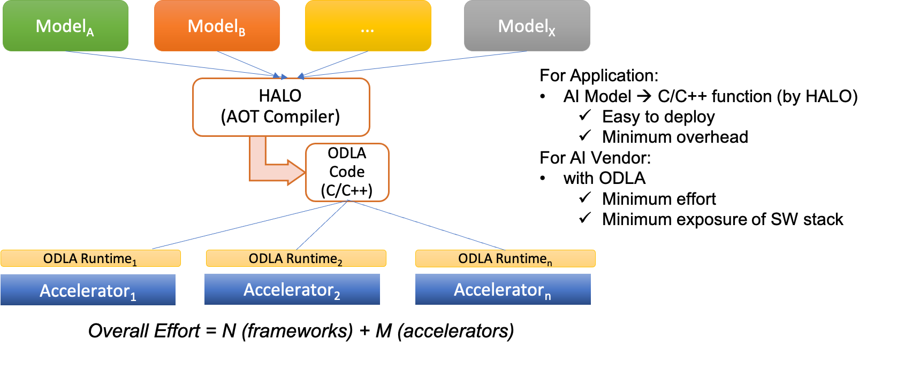
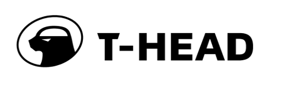
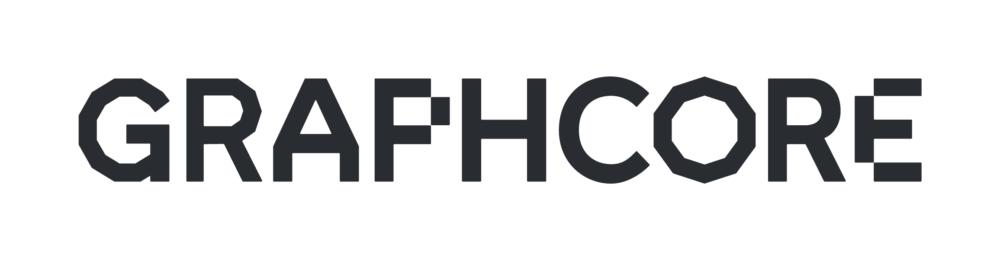
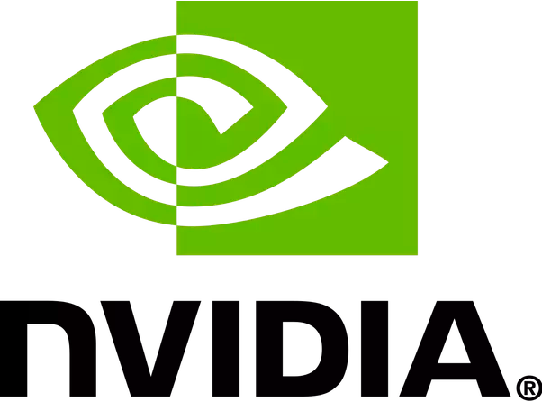
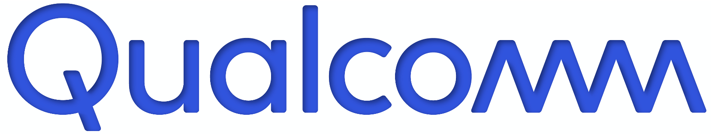
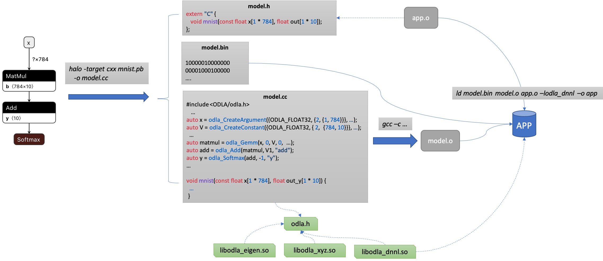

/badge.svg?branch=master)
/badge.svg?branch=master)

HALO
===============

**H**eterogeneity-**A**ware **L**owering and **O**ptimization (**HALO**) is a heterogeneous computing acceleration platform based on the compiler technology.
It exploits the heterogeneous computing power targeting the deep learning field through an abstract, extendable interface called Open Deep Learning API (**ODLA**).
HALO provides a unified Ahead-Of-Time compilation solution, auto tailored for cloud, edge, and IoT scenarios.

HALO supports multiple compilation modes. Under the ahead-of-time (AOT)
compilation mode, HALO compiles an AI model into the C/C++ code written
in the ODLA APIs. The compiled model can be run on any supported
platform with the corresponding ODLA runtime liibrary. Plus, HALO is
able to compile both host and heterogeneous device code simultaneously.
The picture below shows the overall compilation flow:

HALO has supported the compilation of models from the following frameworks:
- Caffe
- ONNX
- TensorFlow
- TFLite

More frameworks will be supported soon.

HALO supports
[Alibaba's first AI-inference chip](https://www.alibabacloud.com/blog/announcing-hanguang-800-alibabas-first-ai-inference-chip_595482
): [Hanguang-800 NPU](https://www.t-head.cn/product/npu?spm=a2ouz.12987052.0.0.7d1a6245rNL0T1)
via its [HgAI SDK](http://doc.ratelnn.com).
Hanguang-800 NPU is designed by [T-Head Semiconductor Co., Ltd.](https://www.t-head.cn) (also known as PingTouGe),
a business entity of Alibaba Group.

A broad ODLA ecosystem is supported via the ODLA runtime library set
targeting various heterogeneous accelerators/runtimes:
- [Eigen](http://eigen.tuxfamily.org)
- [Graphcore® IPU](https://www.graphcore.ai)
- [Intel® oneAPI](https://github.com/oneapi-src)
- [Qualcomm® Cloud AI 100](https://www.qualcomm.com/products/cloud-artificial-intelligence)
- [TensorRT™](https://developer.nvidia.com/tensorrt)
- [XNNPACK](https://github.com/google/XNNPACK)

And we welcome new accelerator platforms to join in the ODLA community.

ODLA API Reference can be found
[here](https://alibaba.github.io/heterogeneity-aware-lowering-and-optimization/odla_docs/html/index.html)
and detailed programming guide be coming soon...

## Partners

We appreciate the support of ODLA runtimes from the following partners:

<!-- alphabetical order of partners -->

 

  
  
  

## How to Use HALO

To build HALO, please follow the instructions [here](docs/how_to_build.md) ([查看中文](docs/README_CN.md)).

The workflow of deploying models using HALO includes:
1. Use HALO to compile the model file(s) into an ODLA-based C/C++ source file.
2. Use a C/C++ compiler to compile the generated C/C++ file into an object file.
3. Link the object file, the weight binary, and specific ODLA runtime library together.

### A Simple Example

Let's start with a simple example of MNIST based on
[TensorFlow Tutorial](https://chromium.googlesource.com/external/github.com/tensorflow/tensorflow/+/r0.10/tensorflow/g3doc/tutorials/mnist/beginners/index.md).
The diagram below shows the overall workflow:

Brief explanations:

HALO generates 3 files:
* mnist.h : the header file to be used by application.
* mnist.cc : the ODLA C++ file that represents the model.
* mnist.bin : the weights in ELF format.

To application, the inference is simply viewed as a function call ``mnist()``.

Note that, for portability purpose, HALO always exports functions in the C convention even though the output file model.cc is in the C++ format.

More detailed explanations can be found [here](docs/mnist_sample.md).
Example code can be found [here](models/vision/classification/mnist_simple)

Please refer to [HALO options list](docs/halo_cl_options.md) for all command line options.

### More Examples

* [an end-to-end example of deploying YOLOv3 model](docs/yolo_example.md)
* [using generated code in Python](docs/using_inside_python.md)
* [a list of demos of various models](docs/model_zoo.md)

## Contributing

We're always looking for help to improve HALO. See the [Contributing Guide](docs/CONTRIBUTING.md) for more details.
Thank you!

## Resources

* [ODLA Reference](https://alibaba.github.io/heterogeneity-aware-lowering-and-optimization/odla_docs/html/index.html)
* [How to build HALO](docs/how_to_build.md)
* [HALO options list](docs/halo_cl_options.md)
* [Graphcore Announces Support for ODLA](https://www.graphcore.ai/posts/graphcore-announces-support-for-odla)

## License

HALO is licensed under the [Apache 2.0 License](LICENSE)
