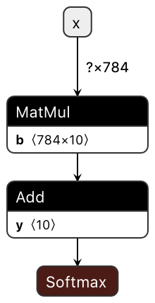

HALO
===============

**H**eterogeneity-**A**ware **L**owering and **O**ptimization (**HALO**) is a heterogeneous computing acceleration platform based on compiler technology.
It exploits the powerfulness of heterogeneous computing while hiding the heterogeneity of computing resources
through the abstract, extendable interface called Open Deep Learning API (**ODLA**). 
HALO provides a unified Ahead-Of-Time compilation solution, auto tailored for various cloud, edge, and IoT scenarios.

- [Get Started](#get-started)
  - [Design Overview](#design-overview)
  - [System Requirements](#system-requirements)
  - [Docker Environment](#docker-environment)
  - [Build From Scratch](#build-from-scratch)
    - [Get HALO](#get-halo)
    - [Configure and Build](#configure-and-build)
    - [Unit Tests](#unit-tests)
  - [Using HALO](#using-halo)
    - [A Simple Example](#a-simple-example)
    - [A Complete Example on Object Detection](#a-complete-example-on-object-detection)
    - [Example of Using Inside Python](#example-of-using-inside-python)
    - [More Examples](#more-examples)
      - [Image Classification](#image-classification)
      - [Object Detection & Segmentation](#object-detection--segmentation)
      - [NLP](#nlp)
    - [List of HALO Command Line Options:](#list-of-halo-command-line-options)
- [Contributions and Feedback](#contributions-and-feedback)
  - [Coding Standards](#coding-standards)
  - [Issues](#issues)
- [License](#license)
  
# Get Started <a name="get-started">

## Design Overview <a name="design-overview">

Recently new domain specific heterogeneous hardware platforms are booming for
accelerating AI applications. However, it faces a twofold challenge to deploy 
and enable these heterogeneous accelerators in a production environment. 

First, various ML frameworks are used to build and run ML algorithms and applications,
e.g., TensorFlow, PyTorch, Caffe, and MxNet, etc. Each framework consists its own closed software
ecosystem although some converters exist for converting between each other.
Second, heterogenous accelerators are normally fragmented and diversified, in terms
of functionality, performance, scalability, and integrability.

The objective of HALO is to address the above challenge by designing a
centralized and uniform heterogeneity-aware compiler targeting AI applications in
cloud, edge and IoT fields.
The HALO front-end parses models and algorithms, which are built from widely used frameworks including
TensorFlow, Caffe, ONNX and more, into a multi-level and multi-grained intermediate representation, HALO IR.
The middle-end of HALO then performs essential and profitable transformations and
optimizations at the IR level.

In order to adapt and integrate with accelerators on which only high-level
SDKs are available, HALO introduces a uniform, abstract, and hardware-independent
interface, Open Deep Learning API (ODLA).
ODLA consists of logical computing operations, as well as 
device related operations, which are semantic enough to represent the device
runtime logic but abstract enough to hide any hardware implementation details.
The back-end of HALO code-generates a device independent program written in ODLA. 
The uniform ODLA program is cross-platform and can be ported
and deployed on various accelerators by linking with hardware-specific runtime libraries.

HALO decouples the upper-level algorithms from the lower-level hardware implementations.
With the compiler technology and the abstract ODLA interface, it unleashes the
power of heterogeneous hardware and accelerates applications smoothly and
transparently. Furthermore, it allows computing workload to be dispatched and
switched among different accelerators dynamically.

## System Requirements <a name="system-requirements"/>

HALO has been fully tested in the following development environment:

OS:
* Ubuntu 18.04

Tools and libraries:
* C++ compiler that supports C++17. (e.g. GCC >= 7.5.0)
* CMake (>= 3.14.5)
* Clang tools (>= 9.0)
* glog (>= 0.4)
* Protobuf 3.9.1

Software packages for some demos and examples:
* OpenCV 3.2.0
* Python3
* PyTorch and TensorFlow / Keras (to get pretrained model)
* ImageMagick (to preprocess test images)
* Device acceleration libraries:
  * [DNNL](https://github.com/oneapi-src/oneDNN)
  * [XNNPACK](https://github.com/google/XNNPACK)
  * [TensorRT](https://developer.nvidia.com/tensorrt)

NVIDIA® GPU environment:
* CUDA® (>= 10.0) 
* CUDA® Deep Neural Network library™ (cuDNN) (>= 7.6.0)
* TensorRT™ (7.0.0)

## Docker Environment <a name="docker-environment"/>

For convenience, the above system requirements are also prepared and packed as a docker environment,
which is under [utils/docker](utils/docker):

* [Dockerfile](utils/docker/Dockerfile): contains all necessary software.
* [build_image.sh](utils/docker/build_image.sh): it builds two docker images:
  * CPU-only: [ubuntu 18.04](https://hub.docker.com/_/ubuntu) based image;
  * CPU + GPU: [nvidia/cuda:10.0-cudnn7-devel-ubuntu18.04](https://hub.docker.com/r/nvidia/cuda) based image.
* [start_docker_cpu.sh](utils/docker/start_docker_cpu.sh): starts the CPU-only container.
* [start_docker_gpu.sh](utils/docker/start_docker_gpu.sh): starts the container for CPU-only and CUDA® supported environments.

## Build From Scratch <a name="build-from-scratch"/>

### Get HALO <a name="get-halo"/>
  ```bash
  git clone https://github.com/alibaba/heterogeneity-aware-lowering-and-optimization.git --recurse-submodules -j8
  ```
### Configure and Build <a name="configure-and-build">

```bash
mkdir halo/build
cd build
cmake -DCMAKE_BUILD_TYPE=Release -G Ninja ..
ninja
```
Some CMAKE options:
* CMAKE_BUILD_TYPE=[Release|Debug]: select the build type.
* -DHALO_USE_GLOG=[ON]: use glob library for logging by default.
* -DHALO_CCACHE_BUILD=[ON] : enable or disable ccache for build.
 
### Unit Tests <a name="unit-tests"/>

HALO uses [llvm-lit](https://llvm.org/docs/CommandGuide/lit.html) test tools for unit testing. To run all unit tests, simply by

```bash
ninja check-halo
```

## Using HALO <a name="using-halo"/>

A computation model, which is similar to a function, consists of input nodes, constant nodes,
computational nodes and output nodes.

HALO compiles the whole model into an ODLA-based C/C++ function, in which input nodes and output
nodes are represented as function arguments passed by pointers. The function body consists of
ODLA-based APIs corresponding to the computational nodes.

Constants (weights) are compiled into a separate file, either a C/C++ source file or a
binary ELF file.

Basic usage:
```bash
halo [options] model_files -o output_odla_file
```

Below is a typical workflow of deploying a model using HALO:
1. Use HALO to compile the model file(s) into an ODLA-based C/C++ source file.
2. Use a conventional C/C++ compiler to compile the generated C/C++ file into an object file.
3. Link the object file, the generated weight file, and the ODLA device runtime libraries.

### A Simple Example <a name="a-simple-example"/>

Let's start with a simple example.
Given a simple TensorFlow model for MNIST handwritten digit classification based on [TensorFlow Tutorial](https://chromium.googlesource.com/external/github.com/tensorflow/tensorflow/+/r0.10/tensorflow/g3doc/tutorials/mnist/beginners/index.md):



First, compile the model into ODLA C++ code:
```bash
halo -target cxx mnist_simple.pb -o out/model.cc
```
It generates 3 files: 
* out/model.h : the header file to be used by application
* out/model.cc : the ODLA C++ file that represents the model
* out/model.bin : the weights

From generated *model.h*:
```c++
extern "C" {
void mnist_simple(const float x[1 * 784], float out_y[1 * 10]);
void mnist_simple_init();
void mnist_simple_fini();
};
```
*mnist_simple()* is the entry function to do the inference, which takes array *x* as input and results will be written into *out_y*.
*mnist_simple()* can be called multiple times while
*mnist_simple_init()* and *minist_simple_fini()* are called once to initialize and to cleanup the whole computation process, respectively.

By default, the names of the above three functions are derived from the filename of inputs.  In [YOLO v3 example](#a-complete-example-on-object-detection), we will demonstrate how to specify function names.

Note that, for portability purpose, HALO always exports functions in the C convention even though the output file model.cc is in the C++ format.

*model.cc* is an ODLA-based C++ file. The main part of it is to build
the model computation using ODLA APIs:

```c++
// Graph building
static void mnist_simple_helper() {
  odla_CreateComputation(&Comp);
  auto x = odla_CreateArgument({ODLA_FLOAT32, {.size = 2, .dims = {1, 784}}},
                               (const odla_value_id)("x"));
  auto V =
      odla_CreateConstant({ODLA_FLOAT32, {.size = 2, .dims = {784, 10}}},
                          Variable, (const odla_value_id) "V");
  auto V1 = odla_CreateConstant(
      {ODLA_FLOAT32, {.size = 2, .dims = {1, 10}}}, Variable_1_broadcasted_7,
      (const odla_value_id) "V1");
  auto MatMul =
      odla_Gemm(x, 0, V, 0, 1, 0, nullptr, {.size = 2, .dims = {1, 10}},
                (const odla_value_id) "MatMul");
  auto add =
      odla_Add(MatMul, V1, (const odla_value_id) "add");
  auto y = odla_Softmax(add, -1, (const odla_value_id) "y");
  odla_SetValueAsOutput(y);
}

// Entry function
void mnist_simple(const float x[1 * 784], float out_y[1 * 10]) {
  // ...some setup code skipped.
  mnist_simple_init(); // it calls mnist_simple_helper() once.
  odla_BindToArgumentById((const odla_value_id) "x", x, Ctx);
  odla_BindToOutputById((const odla_value_id) "y", out_y, Ctx);
  odla_ExecuteComputation(Comp, Ctx, ODLA_COMPUTE_INFERENCE, nullptr);
}
```

The code snippet of demo application (main.cc):
```c++
#include "out/model.h" // include the generated header.
int main(int argc, char** argv) {
  //... read 1000 images & labels.
  mnist_simple_init(); // Initialize computation.
  
  int correct = 0;
  for (int i = 0; i < 1000; ++i) {
    std::array<float, 28 * 28> input;
    std::array<float, 10> output;
    // ... preprocess inputs
    mnist_simple(input.data(), output.data());
    int pred = std::max_element(output.begin(), output.end()) - output.begin();
    correct += (pred == labels[i]);
  }
  std::cout << "Accuracy: " << << correct / 1000.0 << "% \n";
  mnist_simple_fini(); // Clean up.
}
```

Next, we can use any modern C++ compiler to compile the generated code:

```bash
g++ out/model.cc -I<halo_install_path>/include -c -o out/model.o
g++ main.cc -Iout -c -o out/main.o
```
Assume we link it with a DNNL based ODLA accelerating runtime library:
```bash
g++ -o out/demo out/main.o out/model.o out/model.bin \
  -L<halo_install_path>/lib/ODLA -lodla_dnnl -Wl,-rpath=<halo_install_path>/lib/ODLA
```
To switch to the TensorRT based ODLA runtime, just simply replace "-lodla_dnnl" with "-lodla_tensorrt".

MNIST example code can be found [here](models/vision/classification/mnist_simple)

Please refer to [HALO options list](#list-of-halo-command-line-options) for all command line options.

### A Complete Example on Object Detection <a name="a-complete-example-on-object-detection"/>

This example demonstrates how to deploy a pretrained
[YOLO v3](https://pjreddie.com/darknet/yolo/) model with pre-processing and post-processing on host.

First, download the model from [ONNX Model Repository](https://github.com/onnx/models/tree/master/vision/object_detection_segmentation/yolov3).
For demonstration purpose, we use [XNNPACK](https://github.com/google/XNNPACK)-based ODLA runtime, which
supports the ODLA interpret programming mode.

Next, compile the model into the C code:
```bash
halo -target cc -exec-mode=interpret -emit-value-id-as-int -reorder-data-layout=channel-last -remove-input-transpose -remove-output-transpose  -o out/yolo.c yolov3-10.onnx  --disable-broadcasting -outputs conv2d_59 -outputs conv2d_67 -outputs conv2d_75 -input-shape=input_1:1x3x416x416 -entry-func-name=yolo_v3
```
Options explained:
* `-target cc`: to generate the C99 code.
* `-exec-mode=interpret`: to generate the ODLA interpret mode code.
* `-emit-value-as-int`: to generate the ODLA value ids as integers.
* `-reorder-data-layout=channel-last`: to enable the data layout conversion since ONNX uses NCHW while the XNNPACK runtime prefers NHWC.
* `-remove-input-transpose`: to optimize away the input transpose.
* `-remove-output-transpose`: to optimize away the output transpose.
* `-disable-broadcasting`: to disable the offline weights broadcasting since the ODLA runtime supports element-wise ops with broadcasting.
* `-outputs`: to specify the output nodes by their names.
* `-input-shape`: to explicitly specify the input shape.
* `-entry-func-name=yolo_v3`: to specify the generate function names as yolo_v3(), yolo_v3_init() and yolo_v3_fini().
  
A complete Yolo application, including the input preprocessing, inferencing,
and the result rendering, can be found [here](models/vision/detection/yolo).

### Example of Using Inside Python <a name="example-of-using-inside-python"/>

HALO generated ODLA function can also be used inside Python.

Here we use [CaffeNet](https://papers.nips.cc/paper/4824-imagenet-classification-with-deep-convolutional-neural-networks.pdf) as an example.

First, we compile the Caffe model into ODLA:
```bash
halo deploy.prototxt bvlc_reference_caffenet.caffemodel -target cxx -disable-broadcasting -entry-func-name=caffenet -batch-size=1 --input-shape=data:1x3x227x227 -o deploy.cc

g++ deploy.cc -c -fPIC -o deploy.o -I<halo_install_path>/include
```
Then, link it as a shared library using the TensorRT-based ODLA runtime library:
```bash
g++ -shared deploy.o deploy.bin -lodla_tensorrt -L <halo_install_path>/lib/ODLA -Wl,-rpath=<halo_install_path>/lib/ODLA -o /tmp/deploy.so
```

In a Python script, the CaffeNet inference can be invoked as:

```python
#...
c_lib = ctypes.CDLL('/tmp/deploy.so')
image = get_image_as_ndarray(path)
image = preprocess(image)
image = image.astype(ctypes.c_float)
ret = (ctypes.c_float * 1000)()
c_lib.caffenet(ctypes.c_void_p(image.ctypes.data), ret)
ret = np.array(ret)
ind = ret.argsort()[-3:][::-1]
#...
```

CaffeNet example can be found [here](models/vision/classification/caffenet).

### More Examples <a name="more-examples"/>

[models directory](models/) contains scripts for the following models, which download the pretrained models, compile and deploy them using HALO on X86-CPU or NVGPU.
Please refer to [Instruction.md](models/Instruction.md) for more details about how to run the examples.


#### Image Classification <a name="image-classification"/>

| Model Class                                                                                                       | Model Source                                                                                                                                                   | HALO Examples                             |
| ----------------------------------------------------------------------------------------------------------------- | -------------------------------------------------------------------------------------------------------------------------------------------------------------- | ----------------------------------------- |
| [AlexNet](https://arxiv.org/abs/1404.5997)                                                                        | [PyTorch](https://pytorch.org/hub/pytorch_vision_alexnet/)                                                                                                     | models/vision/classification/alexnet      |
| [CaffeNet](https://papers.nips.cc/paper/4824-imagenet-classification-with-deep-convolutional-neural-networks.pdf) | [BVLC/Caffe](https://github.com/BVLC/caffe/tree/master/models/bvlc_reference_caffenet)                                                                         | models/vision/classification/caffenet     |
| [DenseNet-121](https://arxiv.org/abs/1608.06993)                                                                  | [PyTorch](https://pytorch.org/hub/pytorch_vision_densenet/)                                                                                                    | models/vision/classification/densenet     |
| [GoogleNet](https://arxiv.org/abs/1409.4842)                                                                      | [PyTorch](https://pytorch.org/hub/pytorch_vision_googlenet/)                                                                                                   | models/vision/classification/googlenet    |
| [Inception_V1](https://arxiv.org/abs/1409.4842)                                                                   | [ONNX](https://github.com/onnx/models/tree/master/vision/classification/inception_and_googlenet/inception_v1)                                                  | models/vision/classification/inception    |
| [Inception_V3](https://arxiv.org/abs/1512.00567)                                                                  | [PyTorch](https://pytorch.org/hub/pytorch_vision_inception_v3/)                                                                                                | models/vision/classification/inception    |
| [MNIST](http://yann.lecun.com/exdb/mnist/)                                                                        | [TensorFlow Tutorial](https://chromium.googlesource.com/external/github.com/tensorflow/tensorflow/+/r0.10/tensorflow/g3doc/tutorials/mnist/beginners/index.md) | models/vision/classification/mnist_simple |
| [MobileNet_V2](https://arxiv.org/abs/1801.04381)                                                                  | [PyTorch](https://pytorch.org/hub/pytorch_vision_mobilenet_v2/)                                                                                                | models/vision/classification/mobilenet    |
| [Resnet V1-18](https://arxiv.org/abs/1512.03385)                                                                  | [ONNX](https://github.com/onnx/models/raw/master/vision/classification/resnet/model/resnet18-v1-7.onnx)                                                        | models/vision/classification/resnet       |
| [ResNet V2-50](https://arxiv.org/abs/1603.05027)                                                                  | [ONNX](https://github.com/onnx/models/raw/master/vision/classification/resnet/model/resnet50-v2-7.onnx)                                                        | models/vision/classification/resnet       |
| [ResNet V2-101](https://arxiv.org/abs/1603.05027)                                                                 | [ONNX](https://github.com/onnx/models/raw/master/vision/classification/resnet/model/resnet101-v2-7.onnx)                                                       | models/vision/classification/resnet       |
| [ShuffleNet](https://arxiv.org/abs/1707.01083)                                                                    | [ONNX](https://github.com/onnx/models/blob/master/vision/classification/shufflenet/model/shufflenet-9.onnx)                                                    | models/vision/classification/shufflenet   |
| [ShuffleNet_V2](https://arxiv.org/abs/1707.01083)                                                                 | [ONNX](https://github.com/onnx/models/blob/master/vision/classification/shufflenet/model/shufflenet-v2-10.onnx)                                                |
| [SqueezeNet_10](https://arxiv.org/abs/1602.07360)                                                                 | [PyTorch](https://pytorch.org/hub/pytorch_vision_squeezenet/)                                                                                                  | models/vision/classification/squeezenet   |
| [SqueezeNet_11](https://arxiv.org/abs/1602.07360)                                                                 | [PyTorch](https://pytorch.org/hub/pytorch_vision_squeezenet/)                                                                                                  | models/vision/classification/squeezenet   |
| [VGG-16](https://arxiv.org/abs/1409.1556)                                                                         | [PyTorch](https://pytorch.org/hub/pytorch_vision_vgg/)                                                                                                         | models/vision/classification/vgg          |
| [VGG-19](https://arxiv.org/abs/1409.1556)                                                                         | [PyTorch](https://pytorch.org/hub/pytorch_vision_vgg/)                                                                                                         | models/vision/classification/vgg          |


#### Object Detection & Segmentation <a name="object-detection--segmentation"/>

| Model Class                                    | Model Source                                                                                     | HALO Examples                      |
| ---------------------------------------------- | ------------------------------------------------------------------------------------------------ | ---------------------------------- |
| [YOLO v3](https://pjreddie.com/darknet/yolo/)  | [ONNX](https://github.com/onnx/models/tree/master/vision/object_detection_segmentation/yolov3)   | models/vision/detection/yolo       |
| [UNet](https://arxiv.org/abs/1505.04597)       | [PyTorch](https://pytorch.org/hub/mateuszbuda_brain-segmentation-pytorch_unet/)                  | models/vision/segmentation/unet    |
| RetinaNet                                      |                                                                                                  |
| SSD                                            |                                                                                                  |

#### NLP <a name="nlp"/>

| Model Class | Description |
| ----------- | ----------- |
| BERT        |             |
|             |

### List of HALO Command Line Options: <a name="list-of-halo-command-line-options"/>

Command line options of HALO:

| Option                                               | Descriptions                                                                                                                                                                                                                |
| ---------------------------------------------------- | --------------------------------------------------------------------------------------------------------------------------------------------------------------------------------------------------------------------------- |
| `--help`                                             | Display available options.                                                                                                                                                                                                  |
| `--target [cxx\|cc]`                                 | `cxx`: Generate the C++11 souce code.  <br> `cc`: Generate the C99 source code.                                                                                                                                             |
| `-o <filename>`                                      | Specify the output file. Weight file is automatically generated with '.bin' suffix.                                                                                                                                         |
| `--batch-size <number>`                              | Specify/override the batch size of inputs. It assumes the first dimension of input is for batch number.                                                                                                                     |
| `--exec-mode=[compile\|interpret]`                    | Specify the ODLA execution mode. Default is the `compile` mode.                                                                                                                                                             |
| `--entry-func-name=<name>`                           | Specify the name of generated function. Default is the model's file name.                                                                                                                                                   |
| `--reorder-data-layout=[channel-first,channel-last]` | Specify the model to be compiled into the specific data layout. By default, the generated ODLA function uses the same data layout (NHWC or NCHW) as the input model. Transpose operation might be inserted for input nodes. |
| `--remove-input-transpose`                           | Remove the transpose operation on input nodes. This option is usually used together with `--reorder-data-layout`.                                                                                                           |
| `--remove-output-transpose`                          | Remove the transpose operation on output nodes. This option is usually used together with `--reorder-data-layout`.                                                                                                          |
| `--inputs=<name>`                                    | Specify the input nodes.                                                                                                                                                                                                    |
| `--input-shape=<shape>`                              | Specify input shape. E.g.: `--input-shape=foo:1x3x10 --input-shape=bar:5x4`. It overrides the shape defined in the model file.                                                                                              |
| `--outputs=<name>`                                   | Specify the output nodes. By default, HALO uses all the sink nodes as outputs. This option with `--inputs` can be used to compile a partial part of the computation.                                                        |
| `--fuse-conv-bias`                                   | Specify to fuse convolution and bias.                                                                                                                                                                                       |
| `--fuse-matmul-bias`                                 | Specify to fuse matmul and bias.                                                                                                                                                                                            |
| `--emit-value-reset`                                 | Specify to emit `odla_ReleaseValue()` whenever an ODLA value is no longer needed under the interpreter mode.                                                                                                                |
| `--emit-value-id-as-int`                             | Specify integer as ODLA value id. By default, HALO generates string-based value id.                                                                                                                                         |
| `--emit-data-as-c`                                   | Generate the weigths file as C file, instead of default ELF file.                                                                                                                                                           |
| `--print-mem-stats`                                  | Display the estimated memory usage.                                                                                                                                                                                         |


# Contributions and Feedback <a name="contributions-and-feedback"/>

We're always looking for help to improve the HALO quality. 

## Coding Standards <a name="coding-standards"/>

We mainly follow the [Google C++ Style Guide](https://google.github.io/styleguide/cppguide.html). 
The [clang-tidy](https://clang.llvm.org/extra/clang-tidy/) is used to enforce the coding style check.

## Issues <a name="issues"/>

We use GitHub issues to track bugs.

# License <a name="license"/>

HALO is licensed under the [Apache 2.0 License](LICENSE)
